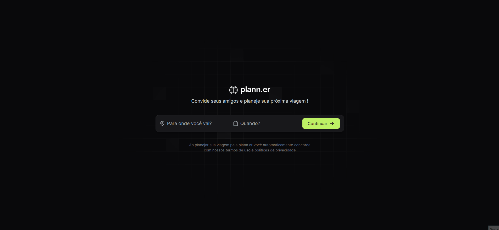
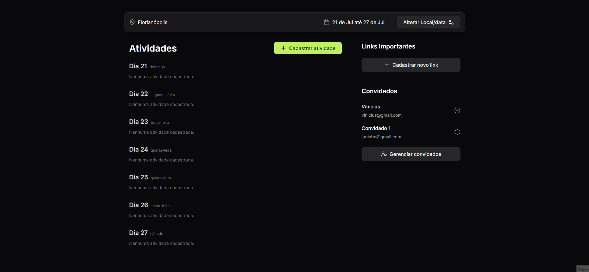
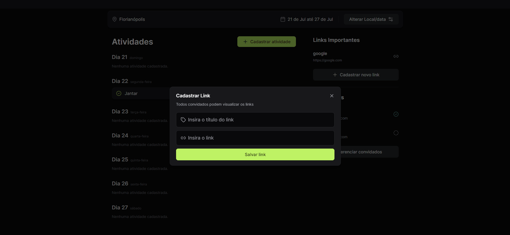
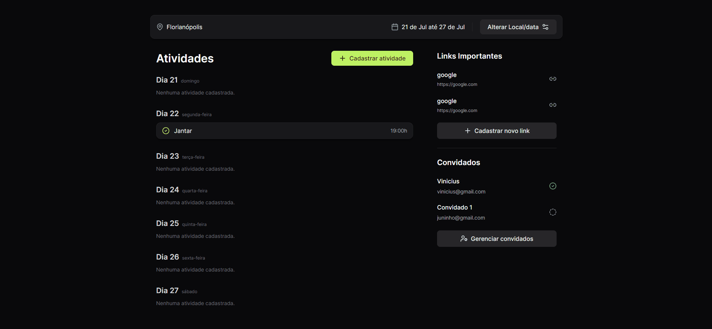

# 👉 NLW Journey - Plann.er 👈

🚀 Bem-vindo ao plann.er ! Meu nome é Vinícius Bueno de Oliveira e este é um projeto que desenvolvi durante a semana do NLW. Esse é o FrontEnd do site em React e TailwindCss, nele além das funcionalidades criadas durante o evento com os professores, eu desenvolvi e implementei muitas outras novas, como modais e requisições para alterar valores no banco de dados.

O backend do projeto é necessário para o funcionamento. Você pode acessá-lo [aqui]([https://vinicius-b-oliveira.github.io/portfolio/](https://github.com/Vinicius-b-oliveira/NLW-plann.er-NodeJs)).

## 📜 Sobre o Projeto 📜

Este projeto foi criado durante a semana do NLW Journey e aprimorado após o término do evento. Ele consiste em um site para programar viagens, com informações, atividades, participantes, etc. É uma aplicação fullstack, portanto usa NodeJs para o backend e React para o frontend. 

## 🚧 Desafios Enfrentados 🚧

🔥 O principal desafio que encontrei foi aprender como usar o typescript, pois não cheguei a aprofundar meus conhecimentos antes do evento. Além disso, por usar o axios para fazer requisições para a Api, tive também que me adaptar nesse sentido. 

## 📸 Visuais 📸

Você pode visualizar algumas imagens do site !

|  |  |
|:---:|:---:|
|  |  

## 🌟 Melhorias Futuras 🌟

🔮 Ainda estou desenvolvendo o site, e a principal melhoria daqui para a frente é deixar o código mais limpo e legível. Além disso, planejo melhorar a lógica dos componentes também. 

## 🌐 Tecnologias Utilizadas

As principais tecnologias desse projeto foram o React, trabalhando com alguns hooks e manipulação de estados, a biblioteca axios para requisições à APIs, TailwindCss para estilização e typescript como linguagem de programação. 

## 🏃‍♂️ Como Executar o Projeto 🏃‍♀️

Para executar este projeto localmente, siga estas etapas:

1. Clone este repositório: `git clone https://github.com/Vinicius-b-oliveira/NLW-plann.er-React.git`
2. Clone o backend do projeto: `git clone https://github.com/Vinicius-b-oliveira/NLW-plann.er-NodeJs.git`
2. Execute o comando `npm run dev` tanto no projeto do frontend quanto no backend.
3. Abra o link que o vite fornecer após a execução do comando no projeto Frontend

## 🤝 Contribuição 🤝

Fique à vontade para abrir issues e pull requests se você tiver sugestões de melhorias. Sua contribuição é muito bem-vinda!
